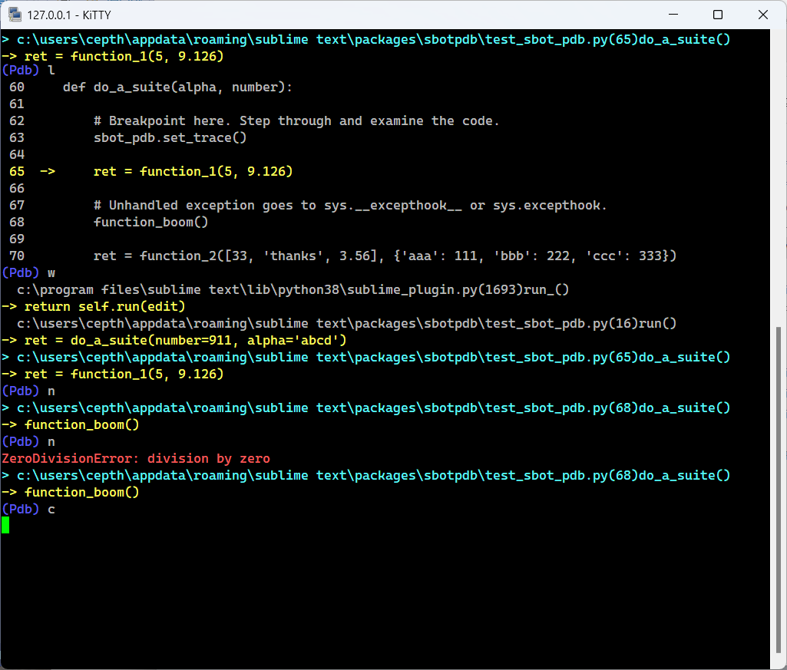
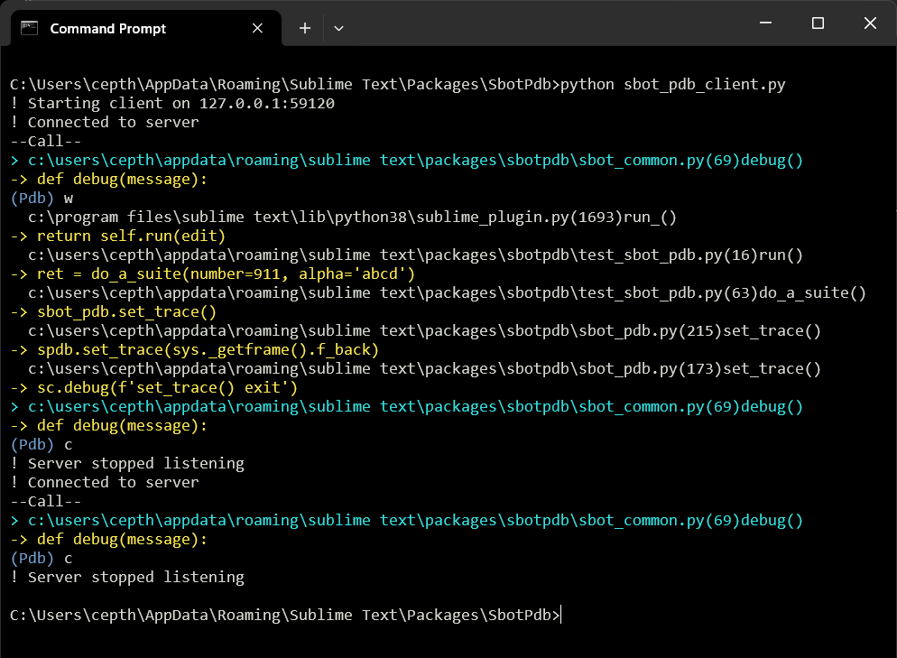

TODO1 sbot/pbot:
  - run unit test paths
  ? clean up all emu_sublime_api.py
  - delete SbotFormat


# PyBagOfTricks
Python odds and ends. Mainly to support Sublime Text plugins.


- Really, python is a mess. https://xkcd.com/1987.


# Plugin Pdb ==== TODO1 some of this here, some in sbot_dev ======

Sublime Text plugin for debugging ST plugins using pdb remotely over a tcp
connection. There are other remote pdb projects but this specifically supports
plugin debugging.

There's a fair amount hacked from [remote-db](https://github.com/ionelmc/python-remote-pdb)
with the addition of ST plugin hooks.

Built for ST4 on Windows. Linux and OSX should be ok but are minimally tested - PRs welcome.

## Features

- Uses generic tcp client - linux terminal, windows putty, etc. Or better yet, use the
  [Fancy Client](#fancy-client).
- Option for colorizing of output. Totally unnecessary but cute.
- Optional timeout can be set to force socket closure which unfreezes the ST application rather
  than having to forcibly shut it down.



## Usage

General workflow goes something like the following. A typical usage is demonstrated with
[example](https://github.com/cepthomas/SbotPdb/blob/main/example.py).

1. Copy `sbot_pdb.py` to the directory of the plugin you are debugging.

1. Optionally edit the configuration block in this file.

1. Edit the file being debugged and add this at the place you want to break:

  `from . import sbot_pdb; sbot_pdb.breakpoint()`

1. Run your client of choice.

1. Run the plugin being debugged. Client should break at the breakpoint line.

1. Now you can use any of the standard pdb commands.

It's usually handy to add a command like this in one of your menus:
```json
{ "caption": "Run pdb example", "command": "sbot_pdb_example" },
```
and a corresponding handler:
```python
class SbotPdbExampleCommand(sublime_plugin.TextCommand):
    def run(self, edit):
        from . import sbot_pdb; sbot_pdb.breakpoint()
        my_plugin_code()
```

## Fancy Client

Optionally you can use the smarter `sbot_pdb_client.py` script which does all of the above plus:
- Automatically connects to the server. This means that you can edit/run your plugin code
  without having to restart the client.
- Detects unresponsive server by requiring a response for each command sent.
- Provides some extra system status information, indicated by `!` (or marker of your choosing).
- Workflow is similar to the above except you can now reload/run the plugin code as part of your dev/edit cycle.
- Optionally edit the configuration block in this file.
- Use ctrl-C to exit the client. The plugin will also stop/unblock.



## Notes

A `sublime-settings` file doesn't make sense for this plugin. Settings are hard-coded in the py files
  themselves. This seems ok since they are unlikely to change often.

Because of the nature of remote debugging, issuing a `q(uit)` command instead of `c(ont)` causes
  an unhandled `BdbQuit` [exception](https://stackoverflow.com/a/34936583).
  Similarly, unhandled `ConnectionError` can occur. They are harmless but if it annoys you,
  add (or edit) this code somewhere in your plugin:
```python
import bdb
def excepthook(type, value, tb):
    if issubclass(type, bdb.BdbQuit) or issubclass(type, ConnectionError):
        return  # ignore
    sys.__excepthook__(type, value, traceback)

# Connect the last chance hook.
sys.excepthook = excepthook
```

Note that sublime is blocked while running the debugger so you can't edit files using ST.
  You may have to resort to *another editor!*.


# SbotFormat ======================

Sublime Text plugin to do simple formatting of common source code files. Doesn't replace the existing file,
shows the content in a new view.

- Prettify json, turns C/C++ style comments into valid json elements, and removes trailing commas.
- Prettify xml.
- Prettify C family (C/C++/C#) files using [AStyle](https://astyle.sourceforge.net/) (which must be installed and in your path). Note: I started with the python astyle module but didn't care for it.

**NOTE:** LSP works much better for json and lua and should be preferred. Keeping this code here for now.

Built for ST4 on Windows. Linux and OSX should be ok but are minimally tested - PRs welcome.


## Commands and Menus

| Command                  | Description                   | Args             |
| :--------                | :-------                      | :--------        |
| sbot_format_json         | Format json content           |                  |
| sbot_format_xml          | Format xml content            |                  |
| sbot_format_cx_src       | Format C/C++/C# content       |                  |
| sbot_format_lua          | Format lua content            |                  |


There is no default `Context.sublime-menu` file in this plugin.
Add the commands you like to your own `User\Context.sublime-menu` file. Typical entries are:
``` json
{ "caption": "Format",
    "children":
    [
        { "caption": "Format C/C++/C#", "command": "sbot_format_cx_src" },
        { "caption": "Format json", "command": "sbot_format_json" },
        { "caption": "Format xml", "command": "sbot_format_xml" },
        { "caption": "Format lua", "command": "sbot_format_lua" },
    ]
}
```

## Settings

| Setting            | Description         | Options                                     |
| :--------          | :-------            | :------                                     |
| tab_size           | Spaces per tab      | Currently applies to all file types         |

## Notes

- `sbot_common.py` contains miscellaneous common components primarily for internal use by the sbot family.
  This includes a very simple logger primarily for user-facing information, syntax errors and the like.
  Log file is in `<ST_PACKAGES_DIR>\User\SbotFormat\SbotFormat.log`.


## ==========================================================================

# Add path to sys if not there yet.
def add_py_path(path):
    if path not in sys.path:
        sys.path.insert(0, path) # or? sys.path.append(path)
# or?? pathlib.Path(_store_path).mkdir(parents=True, exist_ok=True)

        # Provide python path for the module under test.
        src_dir = os.path.abspath(os.path.join(os.path.dirname(__file__), '..'))
        add_py_path(src_dir)


        src_dir = os.path.abspath(os.path.join(os.path.dirname(__file__), '..'))
        add_py_path(src_dir)

