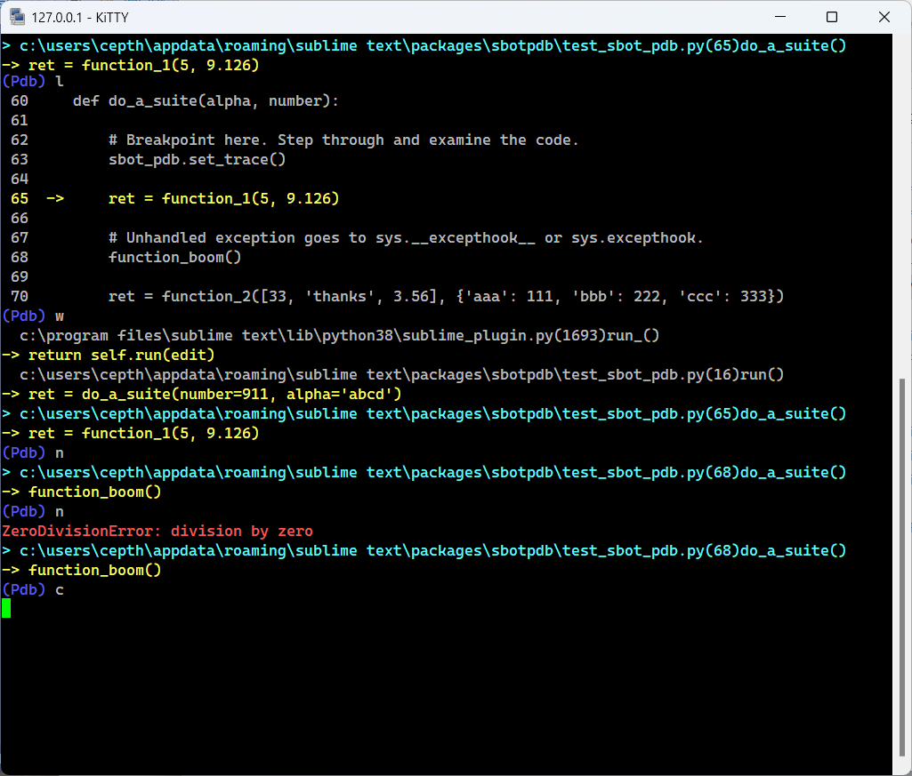

# PyBagOfTricks

Python odds and ends, mainly for debugging (esp. Sublime Text plugins).

# PbotPdb 

- Component for debugging python remotely over a TCP or UDP connection.
- Initially built to debug Sublime Text plugins but is actually generally useful standalone.
- There's a fair amount hacked from [remote-db](https://github.com/ionelmc/python-remote-pdb).
- Built for ST4 on Windows. Linux and OSX should be ok but are minimally tested.

## Features

- Uses generic client - linux terminal, windows putty, NTerm, etc.
- Option for colorizing of output. Totally unnecessary but cute.
- Optional timeout can be set to force socket closure which unfreezes the ST application rather
  than having to forcibly shut it down.



## Usage

General workflow goes something like the following. A typical usage is demonstrated with
[this example](https://github.com/cepthomas/PyBagOfTricks/blob/main/tests/test_pdb.py).

1. Copy `pbot_pdb.py` to the directory of the code you are debugging.
1. Edit the configuration block in this file. Settings are hard-coded in the py files themselves.
   This seems ok since they are unlikely to change often.
1. Edit the file being debugged and add this at the place you want to break:
  `import pbot_pdb; pbot_pdb.breakpoint()`
1. Run your client of choice.
1. Run the code being debugged. Client should break at the breakpoint line.
1. Now you can use any of the standard pdb commands.


## Notes

Because of the nature of remote debugging, issuing a `q(uit)` command instead of `c(ont)` causes
  an unhandled [BdbQuit exception](https://stackoverflow.com/a/34936583).
  Similarly, unhandled `ConnectionError` can occur. They are harmless but if it annoys you,
  add (or edit) this code somewhere in your code being debugged:

```python
import bdb
def excepthook(type, value, tb):
    if issubclass(type, bdb.BdbQuit) or issubclass(type, ConnectionError):
        return  # ignore
    sys.__excepthook__(type, value, tb)

# Connect the last chance hook.
sys.excepthook = excepthook
```

# Plog
Dumb simple logger for python. One per client module, threadsafe.

# Tracer
Tool for tracing through code, especially function entry/exit.
The best (only) documentation is to read [the example](https://github.com/cepthomas/PyBagOfTricks/blob/main/tests/test_tracer.py).
